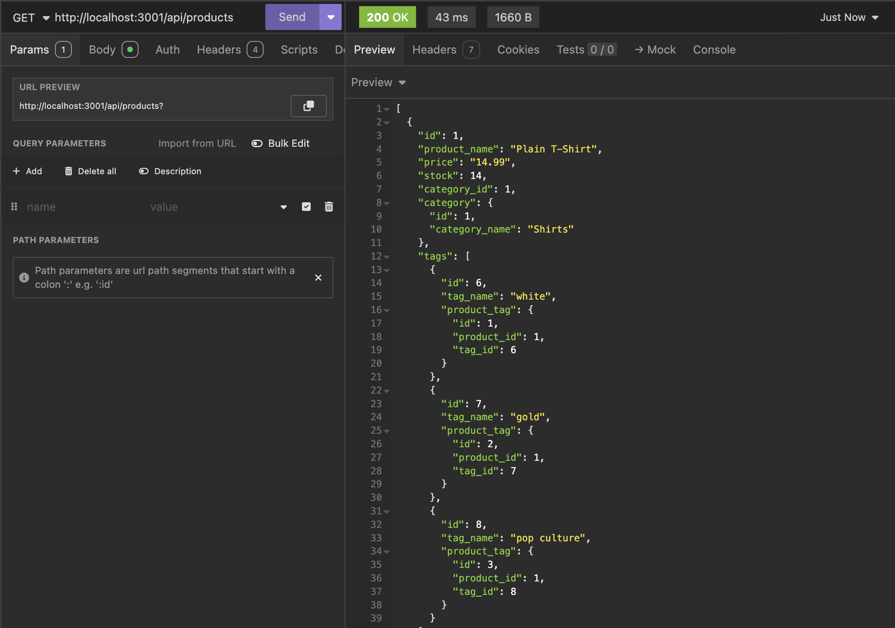

# E-Commerce Server
This application seeds a database and allows for a user to access the information within the database in an API testing software such as Insomnia or Postman.

## Table of Contents
* [Installation](#installation)
* [Usage](#usage)
* [License](#license)
* [Contributing](#contributing)
* [Tests](#tests)
* [Questions](#questions)
 
## Installation
To install the required dependencies, run ```npm install``` and then seed the database by running ```npm run seed```.
 

## Usage

### Starting the Server
To initialize the server, run ```npm run start``` and then navigate over to an API testing software.


### GET requests
To get all of the stored categories, perform a GET request to "localhost.3001/api/categories" and all categories will be delivered.


To get a single category, perform a GET request to "localhost.3001/api/categories/x" with x being the ID of the category that you want to get. Only the selected category will be delivered.


To get all of the stored products, perform a GET request to "localhost.3001/api/products" and all products will appear.


To get a single product, perform a GET request to "localhost.3001/api/products/x" with x being the ID of the product that you want to get. Only the selected product will be delivered.


To get all of the stored tags, perform a GET request to "localhost/api/tags" and all tags will appear


To get a single tag, perform a GET request to "localhost.3001/api/tags/x" with x being the ID of the tag that you want to get. Only the selected tag will be delivered.


### POST requests
To create a new category, perform a POST request to "localhost.3001/api/categories" and include an opbject that follows this convention: 
```
{
    "category_name": "New category name"
}
```


After the request has been made, the new category will be added to the database. To confirm, perform a GET request to "localhost.3001/api/categories".


To create a new product, perform a POST request to "localhost.3001/api/products" and include an object in the body request that follows this convention:
```
{
    "product_name": "New product name",
    "price": 200.00,
    "stock": 3,
    "category_id": 1,
    "tagId": [1, 2, 3]
}
```


After the request has been made, the new category will be added to the database. To confirm, perform a GET request to "localhost.3001/api/products".

To create a new tag, perform a POST request to "localhost.3001/api/tags" and include an object in the body request that follows this convention:
```
{
    "tag_name": "New tag name"
}
```


After the request has been made, the new category will be added to the database. To confirm, perform a GET request to "localhost.3001/api/tags".


### PUT requests

To update a category, make a PUT request to "localhost.3001/api/categories/x" with x being the ID for the category that you want to update. Include an object in the body that follows this convention:
```
{
    "category_name": "Updated category name"
}
```


To confirm the update, make a GET request to "localhost.3001/api/categories/x" and notice the change in the database.

To update a product, make a PUT request to "localhost.3001/api/product/x" with x being the ID for the product that you want to update. Include an object in the body that follows this convention:
```
{
    "product_name": "Updated product name",
    "price": 300.00,
    "stock": 7,
    "category_id": 2
    "tagIds": [2, 4, 6]
}
```


To confirm the update, make a GET request to "localhost.3001/api/products/x" and notice the change in the database.

To update a tag, make a PUT request to "localhost.3001/api/tags/x" with x being the ID for the tag that you want to update. Include an object in the body that follows this convention:
```
{
    "tag_name": "Updated tag name"
}
```


To confirm the update, make a GET request to "localhost.3001/api/tags/x" and notice the change in the database.


### DELETE requests

To delete a category, make a DELETE request to "localhost.3001/api/categories/x" with x being the ID for the category that you want to delete.


To confirm the deletion, make a GET request to "localhost.3001/api/categories" and notice the deleted category is no longer in the database.

To delete a product, make a DELETE request to "localhost.3001/api/product/x" with x being the ID for the product that you want to delete.


To confirm the deletion, make a GET request to "localhost.3001/api/products" and notice the deleted product is no longer in the database.

To delete a tag, make a DELETE request to "localhost.3001/api/tags/x" with x being the ID for the tag that you want to delete.


To confirm the deletion, make a GET request to "localhost.3001/api/tags" and notice the deleted tag is no longer in the database.


## License
[](https://opensource.org/licenses/MIT)

Copyright (c) 2024 Ethan Robert Owens

Permission is hereby granted, free of charge, to any person obtaining a copy
of this software and associated documentation files (the "Software"), to deal
in the Software without restriction, including without limitation the rights
to use, copy, modify, merge, publish, distribute, sublicense, and/or sell
copies of the Software, and to permit persons to whom the Software is
furnished to do so, subject to the following conditions:

The above copyright notice and this permission notice shall be included in all
copies or substantial portions of the Software.

THE SOFTWARE IS PROVIDED "AS IS", WITHOUT WARRANTY OF ANY KIND, EXPRESS OR
IMPLIED, INCLUDING BUT NOT LIMITED TO THE WARRANTIES OF MERCHANTABILITY,
FITNESS FOR A PARTICULAR PURPOSE AND NONINFRINGEMENT. IN NO EVENT SHALL THE
AUTHORS OR COPYRIGHT HOLDERS BE LIABLE FOR ANY CLAIM, DAMAGES OR OTHER
LIABILITY, WHETHER IN AN ACTION OF CONTRACT, TORT OR OTHERWISE, ARISING FROM,
OUT OF OR IN CONNECTION WITH THE SOFTWARE OR THE USE OR OTHER DEALINGS IN THE
SOFTWARE.


## Contributing
If you want to contribute, fork the repository in GitHub and send me any code suggestions. Feel free to reach out via GitHub or email (Both are below).


## Tests
N/A


## Questions
* GitHub: [@Teacher2Coder](https://www.github.com/Teacher2Coder)
* Email: ethan.owens4@gmail.com